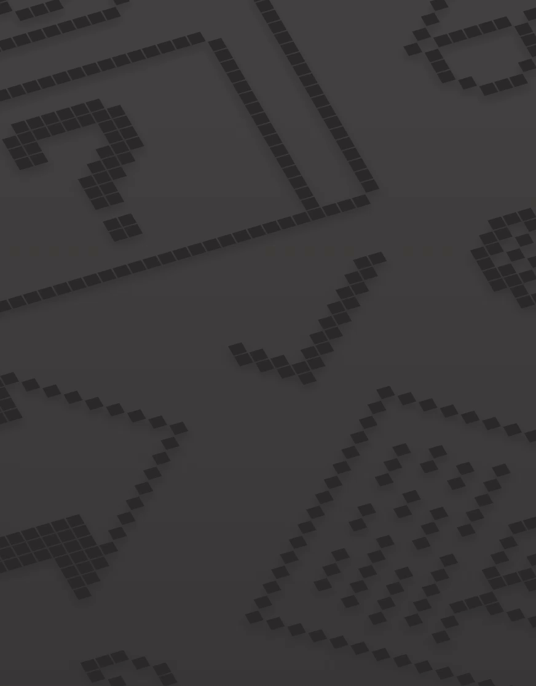

# TetrisV2

TetrisV2 is a C++ Tetris runtime with a Python reinforcement-learning stack.
The runtime owns all game rules and exposes a small C API; the Python package
uses that API for masked-placement PPO, DQN, and discrete Flow-DQN training,
evaluation, expert data generation, and playback.



## Setup

Build the native runtime from the repository root:

```bash
cmake -S . -B build -DCMAKE_BUILD_TYPE=Release
cmake --build build --parallel
ctest --test-dir build --output-on-failure
```

Install the Python package and test tools:

```bash
python -m venv .venv
source .venv/bin/activate
python -m pip install -e ".[dev]"
python -m pytest -q
```

The Python binding discovers the native library in `build/`, including the
usual `Debug` and `Release` subdirectories on multi-config platforms. Commands
that open the runtime also accept `--lib PATH`; `TETRIS_V2_LIBRARY` provides
the same override for tests and automation. The Python package does not bundle
a platform-specific native library, so build the C++ target before using it.

## Train, evaluate, and play

The reliable training pattern is expert warm-start, DAgger data collection,
then online fine-tuning. The complete DQN, structured PPO, and Flow-DQN
commands are in [docs/TRAINING.md](docs/TRAINING.md).

Reusable Hydra presets keep the full experiment arguments in YAML. For
example, the validated Flow-DQN schedule is launched with:

```bash
tetris-train experiment=flow_offline runtime=cuda
tetris-train experiment=flow_online runtime=cuda
```

Use `dry_run=true` to print the resolved trainer configuration without starting
a run, or override an individual setting with Hydra syntax such as
`trainer.args.batch_size=128`.

To evaluate the proven checkpoint already produced in this workspace:

```bash
tetris-eval runs/v3_hybrid_finetune/dqn_hybrid_final.pt \
  --algo dqn \
  --episodes 100 \
  --seed 70000 \
  --max-steps 150 \
  --min-placements 101 \
  --min-lines 20
```

Watch it in a window or terminal:

```bash
tetris-play-rl runs/v3_hybrid_finetune/dqn_hybrid_final.pt --algo dqn
tetris-play-rl-cli runs/v3_hybrid_finetune/dqn_hybrid_final.pt \
  --algo dqn --render-board
```

PPO, DQN, and Flow-DQN can also train without expert data:

```bash
tetris-train-ppo --total-timesteps 500000 --log-dir runs/ppo
tetris-train-dqn --total-timesteps 500000 --log-dir runs/dqn
tetris-train-flow-dqn --online-timesteps 500000 --log-dir runs/flow_dqn
```

Flow-DQN is a full `8 x 40 x 10` masked-action PyTorch adaptation inspired by
[Flow Q-Learning](https://arxiv.org/abs/2502.02538), whose original algorithm
uses continuous actions. It is intentionally documented as a Tetris-specific
discrete adaptation rather than a literal FQL implementation.

For manual play or bot autoplay:

```bash
tetris-play-human
tetris-play-bot --think-ms 20 --auto-reset
```

All console commands can also be run as modules from a source checkout, for
example `python -m scripts.eval_rl --help`.

## RL contract

- The C++ `tetris_cc_*` API is the single source of truth for state, actions,
  rewards, and termination.
- Each observation has 254 bounded features: the visible board, active piece,
  hold piece, five-piece preview, hold availability, combo, and back-to-back
  state.
- A policy chooses among 3,200 stable physical decisions encoded as
  `(use_hold, rotation, landing_y, x)`. One decision optionally holds and then
  locks exactly one piece.
- `info["action_mask"]` identifies legal actions after every reset and step.
  PPO, DQN, Flow-DQN, evaluation, and playback all apply it before selecting
  an action.
- The default training reward combines normalized game score, board-quality
  change, survival, and a top-out penalty. The unshaped C++ score remains in
  `info["raw_reward"]`.
- Checkpoints and datasets using the former eight-action or
  451-feature/97-action schemas are intentionally incompatible with the
  current environment.

## Repository layout

```text
apps/              C++ command-line applications
include/tetris_v2/ Public C++ and C headers
src/               Tetris runtime, planner, bot, and C API
tetris_v2/conf/    Packaged Hydra trainer and experiment presets
tetris_v2/rl/      Gymnasium environment and PPO/DQN/Flow-DQN implementations
scripts/           Training, evaluation, data, and playback entry points
tests/cpp/         Native runtime and C API tests
tests/python/      Binding and RL pipeline tests
tests/data/        Source fixtures for native tests
tests/tools/       Fixture-generation utilities
```

Generated builds, runs, checkpoints, datasets, and local references are ignored
by Git. The removed Version One implementation remains available in repository
history rather than in the active source tree.

## License

Project code is licensed under [`LICENSE`](LICENSE). Cold Clear attribution,
its selected MIT license, and the Flow Q-Learning research attribution are in
[`THIRD_PARTY_NOTICES.md`](THIRD_PARTY_NOTICES.md).
